## 7.1 Lesson Plan - Intro to Client-Side Storage

### Overview

In this class, we will be introducing the concept of data persistence and simple client-side approaches to maintain content between browser sessions.

##### Instructor Priorities

* Students should be able to articulate definitions of data persistence, client-side storage, and server-side storage.

* Students should have a conceptual understanding of the pros and cons of client-side vs. server-side storage.

* Students should become familiar with the concepts of `localStorage` and `cookies`.

* Students should complete the Sign-in Page with localStorage activity.

* Students should complete the To-Do App with localStorage activity.

##### Instructor Notes

* For today's class, avoid "live coding" any of the cookies examples. Cookies are challenging to demonstrate live as it requires first creating a deployed repo and then constantly pushing to the [deployed site](http://cookie-example-rcb.herokuapp.com/). Demonstrate the pre-coded solution, point out this limitation, and move-on. Students do NOT need to know how to code cookies (or localStorage) for the homework.

* Have your TAs reference [7.1-TimeTracker](7.1-TimeTracker.xlsx) to help keep track of time during class.

- - -

### Class Objectives

* To introduce the concept and utility of "data persistence" in web applications

* To demonstrate different methods for client-side data storage (i.e. localStorage, sessionStorage, and cookies)

* To build a semi-complex application taking advantage of localStorage to maintain content between browser sessions.

- - -

### 1. Partners Do: Build a Basic To-Do App (15 mins)

* Divide students into groups of three (either pre-defined or self-selected). Have students sit next to their groups.

* Open up [`1-student-do-todolist-solution.html`](Activities/01-todolist-nopersistence/SOLVED/1-student-do-todolist-solution.html) in the browser and demonstrate the functionality of the intended to-do application. Point-out that the todo items are added consecutively and that clicking the "X" button closes the appropriate todo item.

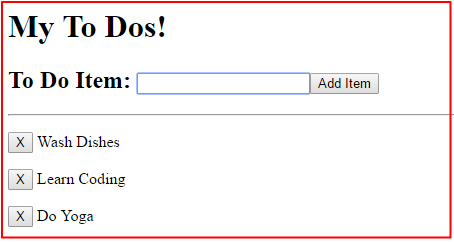

* Then slack out the following files and instructions.

* **Files**:

  * [`1-student-do-todolist`](Activities/01-todolist-nopersistence/1-student-do-todolist.html) (unsolved)

* **Instructions**:

  * Assign one student of the three of you to be the group's typist. All others in the group will help supervise, offer guidance, and help catch bugs that the group's typist might not be able to catch. Throughout this activity (and many of today's activities) you will be switching roles with those in your group.

  * Then create a Basic To-Do application using the [`1-student-do-todolist`](Activities/01-todolist-nopersistence/1-student-do-todolist.html) (unsolved) as a starting point. The HTML is already created for you so you will only have to fill in the javascript sections where there are large blanks. Alternatively, if you are feeling bold and capable, your group may code it from scratch without the use of the base code provided.

  * Helpful Hint: Each of the buttons and text elements should have a dynamically created identifier or data attribute that differentiates one item on the list from another. You should use these attributes to close out the appropriate items when you click on the "X" beside them.

### 2. Instructor Do: Build a Basic To-Do App (7 mins)

* Open the [`1-student-do-todolist-solution.html`](Activities/01-todolist-nopersistence/SOLVED/1-student-do-todolist-solution.html) and walk students through the code.

* Spend the appropriate time necessary to explain how:

  * `var toDoTask` is using `.val()` to retrieve the textbox input.

  * We are creating jQuery elements for `toDoItem` and `toDoClose` to handle the text and buttons.

  * Then point out that we are using a counter via `toDoCount` to give each of these todoItems and buttons identifiers that are unique to them.

  * Finally, point out that we can use the dynamic identifier (numbers) to match and close the right todo item when the appropriate button is clicked.

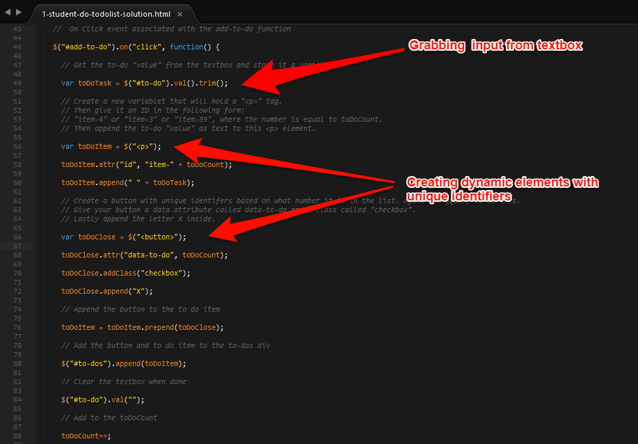

* Then slack out the solution code to students.

### 3. Everyone Do: Go Over the To-Do App (5 mins)

* Have the students discuss amongst their groups the solution to the assignment. If their group's solution did not work, prompt them to understand why this might have been the case before moving on to discussing the solution itself.

### 4. Everyone Do: Losing To-Dos (1 min)

* Ask students to take the working to-do list solution and to then create 15 todo items from their lives.

* Once they are done have them refresh the page.
  * "Oh Noezzz!! All my todos are gone!"

### 5. Instructor Do: Discuss "Data Persistence" (2 min)

* Very briefly use this example to introduce the concept of "data persistence" (i.e. the need to create web applications that are able to store data beyond the lifetime of the browser instance).

* Then (again BRIEFLY) discuss that this week's classes are all about providing the tools the students require to do this.

### 6. Instructor Do: Discuss "Client-Side vs Server-Side" Storage (1 min)

* Introduce students to the concept that data can persist in two ways. We can temporarily store data on users' computers + browsers (client-side) and we can also store that information on an external server/database (server-side).

* Today's class will focus on client-side and the next two classes will focus on server-side approaches.

### 7. Everyone Do: Pros / Cons of Client vs. Server Side Storage (2 min)

* Have students talk to their groups about the possible advantages and disadvantages of using client vs server-side data storage.

  * What would be some cases in which you might want to use one over the other?

### 8. Instructor Do: Explain Pros / Cons of Storage Options  (2 min)

* Answer the questions just given to student. Offer the perspective that...

  * Client-side persistence might be useful for saving login information or information that would allow a web application to work offline. Client-side persistence is also useful for information relevant to having the page load quickly. (i.e. widgets that will get run repeatedly on visits.

  * Server side. Obviously this is where you are going to store the hunk of your data for all your users, customers, locations, etc. Your local machine isn't going to store everyone's data every time. That would make no sense. You need an external storage center for data if you are using server-side persistence.

### 9. Instructor Do: Client-Side Approach Overview (2 min)

* Let students know that we'll be showing them three approaches for performing client-side data persistence. (localStorage, sessionStorage, and cookies). Also point out that there are other approaches out there for doing the same thing and that the major differences between them have to do with:

  * Variable eases of use

  * Compatibility with older browsers

  * Security

### 10. Students Do: Sign-in Page Without Persistence (7 min)

* Open [`2-student-do-signin-no-persistence-solution.html`](Activities/02-signin-nopersistence/SOLVED/2-student-do-signin-no-persistence-solution.html) in the browser and show students the sign-in page. For now the focus should be on creating a sign-in page that simply saves the user input and displays it inside of a text-box.

* Then slack out the following instructions and files.

* **Files:**

  * [`2-student-do-signin-no-persistence`](Activities/02-signin-nopersistence/2-student-do-signin-no-persistence.html) (unsolved)

* **Instructions:**

  * Using the [`2-student-do-signin-no-persistence`](Activities/02-signin-nopersistence/2-student-do-signin-no-persistence.html) as a starting point, fill in the JavaScript code necessary to make the page "save user inputs" and then re-display them on the second panel (most recent member).

  * Note: Don't worry about using client-side saving just yet. Just focus on getting the text inside the inputs and then displaying them via html in the second panel.

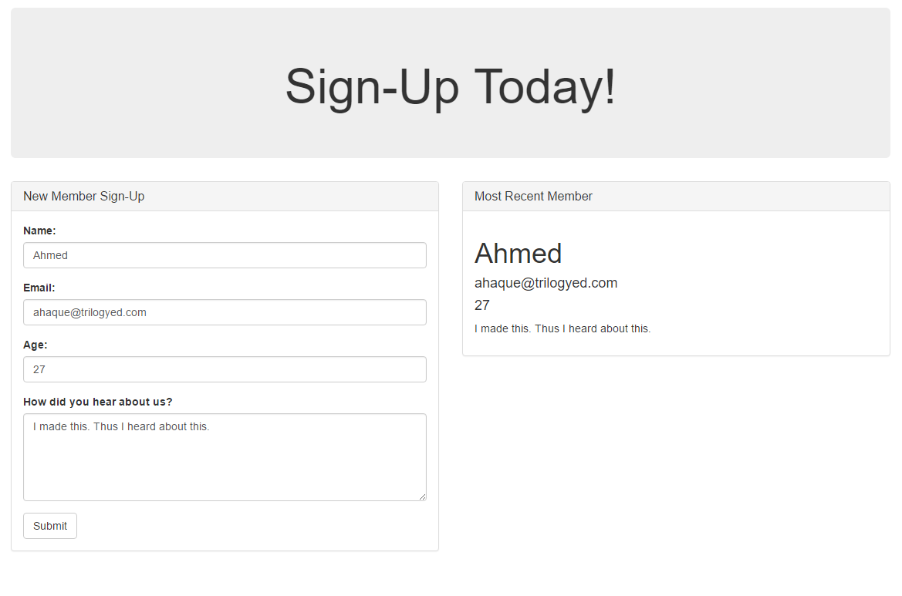

### 11. Instructor Do: Review Sign-in without Persistence (10 min)

* Open [`2-student-do-signin-no-persistence-solution.html`](Activities/02-signin-nopersistence/SOLVED/2-student-do-signin-no-persistence-solution.html) and walk students through understanding the code. Make sure they can re-explain the sections to you line by line!

* Then slack out the solution to students so they have it for the next activity (in case they didn't complete it in time.)

### 12. Instructor Do: Demonstrate localStorage (10 min)

* Open [`3-instructor-do-localstorage.html`](Activities/03-localstorage-demo/3-instructor-do-localstorage.html). Help walk your students through the key lines of code in the program. Point out that data is getting stored in a property associated with localStorage.

  * Try your best to focus on the `localStorage.clear()`, `localStorage.setItem()`, and `localStorage.getItem()` expressions.

  * Point out that localStorage is storing variables in its internal key-value pairing. In essence, localStorage is something like a data object while not explicitly being one.

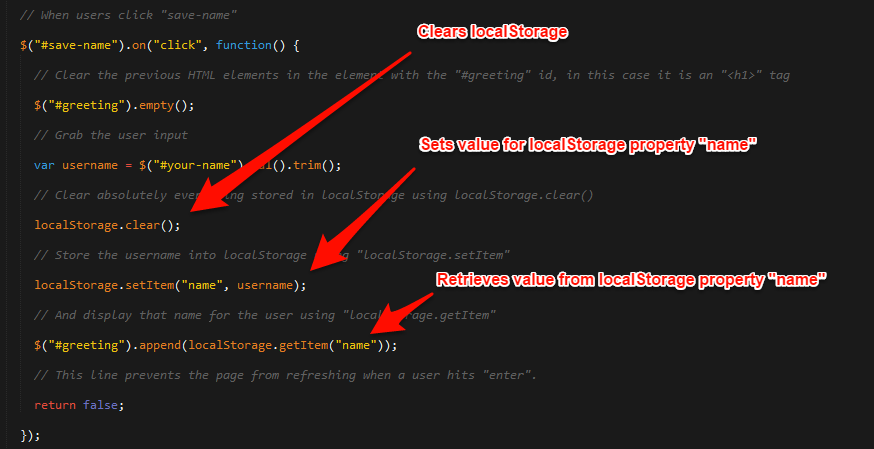

* Explain that we can view and manipulate the contents of local storage with Chrome Developer Tools.

  * Open the Chrome Developer Tools; select the **Application** tab; and click the **Local Storage** button in the left column.

  * Explain that the resulting pane displays the key-value pairs that we set on local storage from our JavaScript.

    * Change the value through the `input` and refresh the page to demonstrate.

  * Explain that we can set the value of our local storage keys directly from the Developer Tools.

    * Change the value through the Developer Tools and refresh the page to demonstrate.

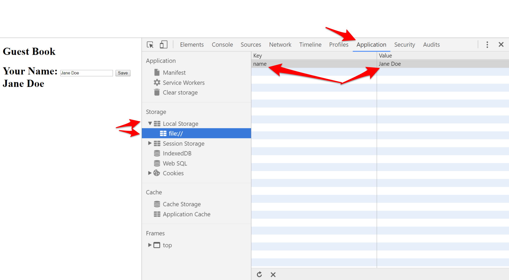

_We can view and manipulate the contents of local storage from the developer tools in Chrome._

* Point out that the developer tools can be useful when debugging applications that use local storage.

  * Encourage students to keep their developer tools open while they work on the next activity.

### 13. Students Do: Sign-in Page with localStorage (15 min)

* Open [`4-student-do-signin-localstorage-solution.html`](Activities/04-signin-localstorage/4-student-do-signin-localstorage-solution.html) in your browser and show them how a re-configured version of the code would work if it utilized localStorage.

* Then slack out the following files and instructions:

* **Files:**

  * [`2-student-do-signin-no-persistence-solution.html`](Activities/02-signin-nopersistence/SOLVED/2-student-do-signin-no-persistence-solution.html) (If you haven't sent this already)

* **Instructions:**

  * Using the solution provided to you in [`2-student-do-signin-no-persistence-solution.html`](Activities/02-signin-nopersistence/SOLVED/2-student-do-signin-no-persistence-solution.html), re-configure the application so that it utilizes localStorage.

  * If your code worked it should save/display the last inputted user even if the tab is closed or if the page is closed and reopened.

### 14. Instructor Do: Review Sign-in with localStorage (10 min)

* Review the code provided in [`4-student-do-signin-localstorage-solution`](Activities/04-signin-localstorage/4-student-do-signin-localstorage-solution.html) -- paying particular attention to point out all the sections where localStorage is being cleared, set, or obtained (i.e. getItem). Also point out the arguments needed to set and get data.

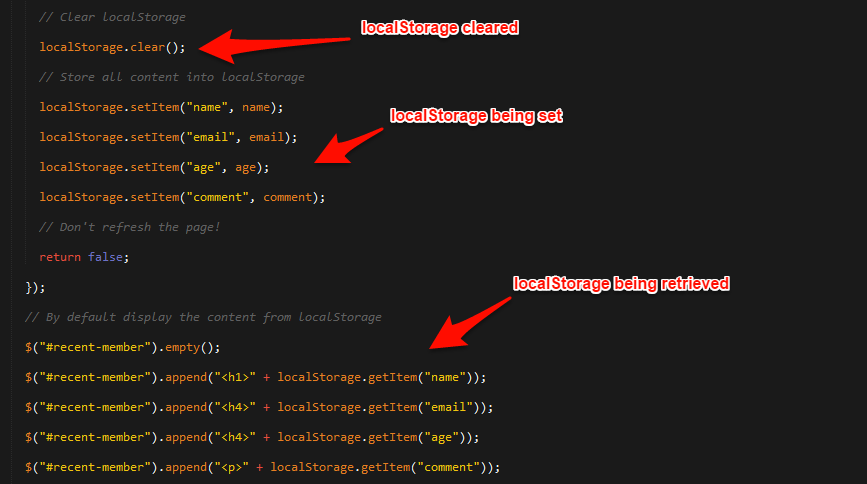

### 15. Everyone Do: Replace Sign-in with sessionStorage (5 min - OPTIONAL)

* Show students that by replacing all of the `localStorage` instances with the word `sessionStorage` we can get a session limited version of the app (i.e. a version of the same program that, when we close tabs or the browser, does not preserve the data. Contrast this to localStorage.)

* You can use [`5-student-do-signin-session-storage-solution.html`](Activities/05-signin-sessionstorage/5-student-do-signin-session-storage-solution.html) to quickly show the solution here.

* Point out that we can view session storage through the developer tools the same way we view local storage data.

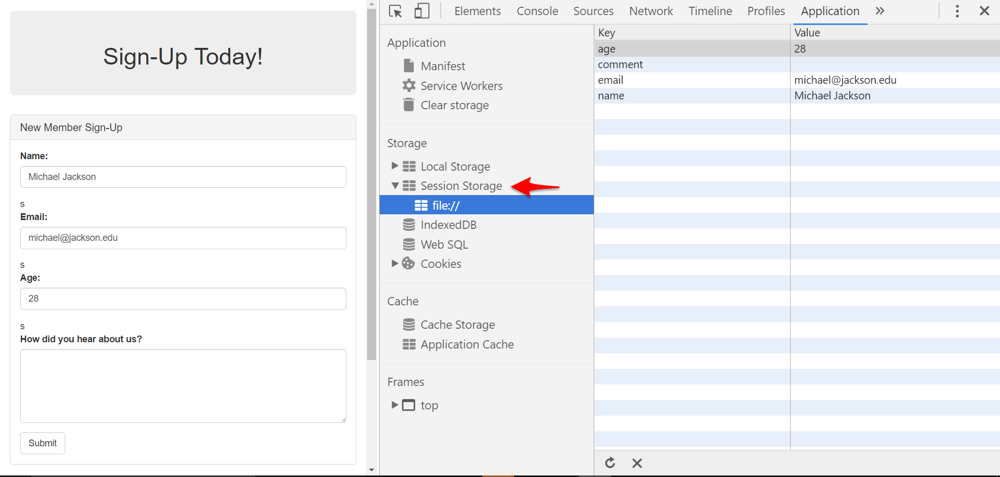

_We can view session storage through developer tools the same we we view local storage data._

- - -

### 16. BREAK (15 min)

- - -

### 17. Instructor Do: Introduce Cookies (5 min)

* **Important**: Warn students that due to security implications, Chrome doesn't support cookies on static local undeployed HTML pages. There are workarounds for this, but in order to demonstrate the activity we will either be going to the deployed heroku version of this activity, OR you can use the firefox or safari browser to demonstrate the desired functionality if desired and convenient. Cookies are not necessary for this weeks homework.

* Warn students that working with cookies can be cumbersome at times.

* Mention cookies are essentially the original form of client-side data storage. It typically involves relaying a cookie string between the machine and a specific web-page.

* Cookies are useful because they are compatible with nearly all browsers so long as users have cookies enabled.

* Cookies aren't as seamless to use as localStorage but, have the native ability to be transported back and forth between the machine and web page.

* When using cookies there is no way to send and receive only "select" bits of information to the server. In essence, any data you collect in cookies is constantly sent back and forth.

* As with localStorage, you SHOULD NOT save sensitive information in cookies.

### 18. Instructor Do: Show Working Cookies App (7 min)

* Walk students through an example of using cookies via this link (or locally with Safari or Firefox): <http://cookie-example-rcb.herokuapp.com/>.

* Then walk students through the code associated: [`6-instructor-do-cookies-intro.html`](Activities/06-cookies-demo/6-instructor-do-cookies-intro.html).

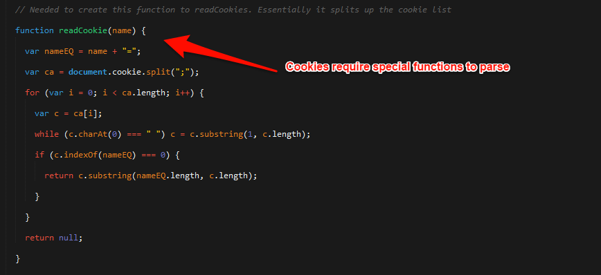

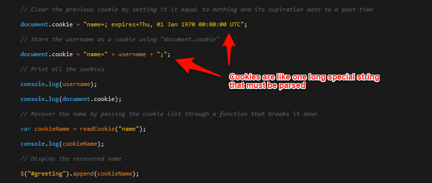

* As you show them the code be sure to point out the following:

  * The `readCookie` function (readCookie functions are readily available online)

    * The key takeaway here is that there is no native way to parse out a cookie's various properties. You need a separate helper function.

  * Point out that cookies are created by adding to the properties of `document.cookie` and that you can set an expiration date of the past to delete them or set the expiration date for some time in the future to make them last until that time.

  * Also point out that, because this is using cookies, we needed to be examine the application through Heroku in order to store data at all. Due to security reasons, Chrome will block cookies if they're being stored on a non deployed HTML page. This makes the process of debugging code with cookies even more painful than it already is.

### 19. Everyone Do: Review Sign-in with Cookies (7 min)

* Slack out the code in [`7-student-do-signin-cookies-solution.html`](Activities/07-signin-cookies/7-student-do-signin-cookies-solution.html) to students and point them to <http://cookies-signin-rcb.herokuapp.com/>. Then have them spend a few minutes reviewing the code, focusing their attention primarily on how much more convoluted the cookie-based code is compared to the localstorage version they worked on earlier.

### 20. Partners Do: To-Do with localStorage (40 min)

* Have the students return to the groups that were created earlier in class and have them assign a new typist to take over as the group's primary coder for this assignment.

* Task students with incorporating data-persistence into the todo list assignment from the beginning of class.

* Demonstrate to students a working version of the code in browser using [`8-student-do-todolist-localstorage-solution.html`](Activities/08-todolist-localstorage/8-student-do-todolist-localstorage-solution.html).

* Warn students that this is a VERY challenging exercise. The point is to take an honest stab at it and see what you can do! Push yourselves!!!

* Slack out the following files and instructions:

* **Files:**

  * [`1-student-do-todolist-solution.html`](Activities/01-todolist-nopersistence/SOLVED/1-student-do-todolist-solution.html) (If you haven't sent this already)

* **Instructions:**

  * Using a working example of the to-do application ([`1-student-do-todolist-solution.html`](Activities/01-todolist-nopersistence/SOLVED/1-student-do-todolist-solution.html)) incorporate the use of `localStorage` to create data persistence.

  * Have the group member who hasn't typed yet become the typist in the group while the other two take on the role of supervisor.

  * HINT: You will need to create an additional array of todos that you can keep adding todo items to.

  * HINT: You will need to selectively delete array elements to get this working properly. (Suggestion: Look into `.splice`)

  * HINT: You will need to take an array and dump the contents into localStorage (Suggestion: Use `JSON.stringify(todoArray)`).

  * HINT: Don't freak out. This is hard, but push yourselves as best you can!

### 21. Instructor Do: Review the To-Do with localStorage (10 min)

* Walk students through the coded solution. [`8-student-do-todolist-localstorage-solution.html`](Activities/08-todolist-localstorage/8-student-do-todolist-localstorage-solution.html) and use the code comments to help guide the discussion.

* Let students know that it's OKAY if it doesn't completely click right away. This was a TOUGH activity.

* Sets up an initial array will hold our todos. If we have todos array in local storage already, use that. Otherwise set list to an empty array.
  

* Each time a user adds a record, it adds to the array, then we dump that array into localStorage, and the HTML using the putOnPage function
  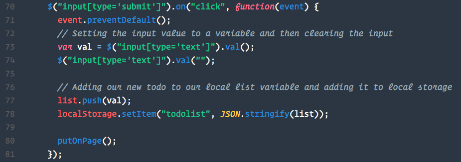

* When a user deletes a todo we clear it from three places (HTML, Array, and localStorage). Note how we use .remove() to remove the todo from the DOM
  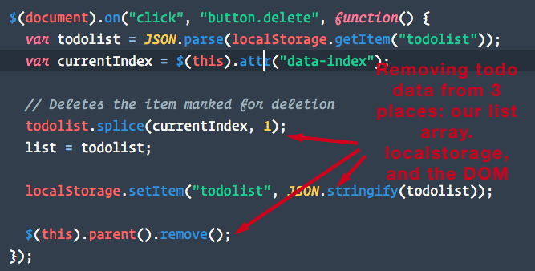

* When we re-load the browser, we run the put on page function will looks for any todos in localstorage and then puts them on the page.
  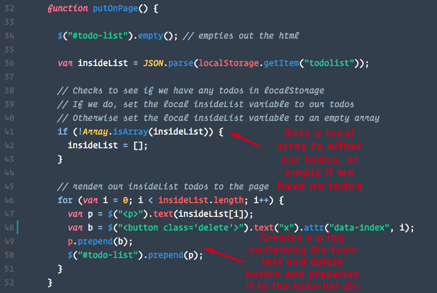

### 22. Instructor Do: Introduce Homework (5 min)

* Demonstrate to students the two homework assignments. _Strongly_ suggest that they aim to do the easier of the two unless they are very, very confident in their JavaScript. The harder of the two homework assignments is SIGNIFICANTLY harder whereas the other assignment is completely doable following the third class of the week. Also let them know that both homework assignments are great milestones because they showcase the ability to work with external data (backend).

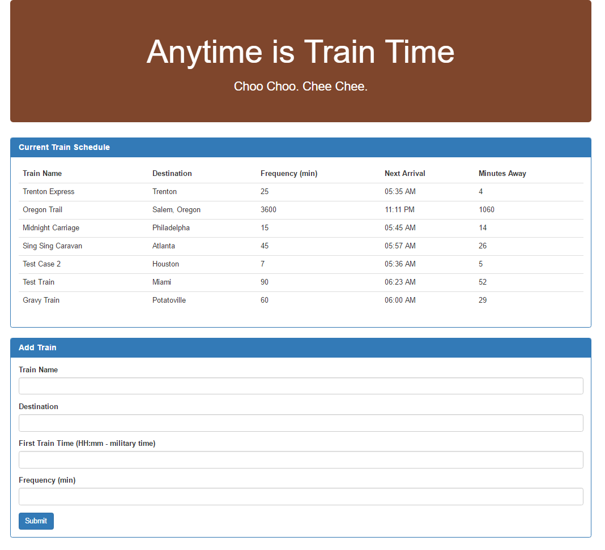

* For the demo of Homework 1, visit: [RCB-TrainTime App](https://rcb-traintime.firebaseapp.com/). (**DON'T SEND STUDENTS THE LINK OR ELSE THE WILL BE ABLE TO DOWNLOAD THE SOURCE CODE!!!**)

* Explain to them the concept as the following:

  * This app lets you see train schedules in the future based on the current time.

  * When you create a new train, you specify the start time and frequency and it will then calculate the next train on the schedule.

* For Homework 2: Demo the RPS Video and open the working solution in your browser.

  * Explain to them that the app allows you to have multiple users all seeing different things on their screens (i.e. if you are the active player you will see one screen while the second player or audience members will see entirely different screens from that of the first).

* Both of these homework assignments rely on Firebase which is what we'll be covering over the next two classes.

### 23. Student Do: Firebase Walkthrough (15 min - OPTIONAL)

* If by some miracle you are done... have students complete the [Firebase Quickstart tutorial](https://www.firebase.com/docs/web/quickstart.html).

- - -

### Copyright

Coding Boot Camp (C) 2015. All Rights Reserved.

# 
